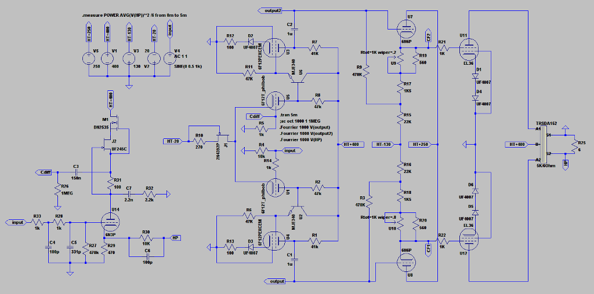

PP d'EL360 à correction différentielle
======================================

Ce projet est la réalisation d'un amplificateur audio à tubes à base d'EL360
incluant un système d'asservissement actif.

Vous trouverez dans le dossier LTspiceIV, deux sous dossiers
Le premier nommé Lib contiens les symboles de modèles additiuonnels de composant
ainsi que les fichiers de composant de base complété au gré des modélisations
ce dossier doit être copié dans vôtre dossier LTspiceIV afin de compléter
ce dernier

Idem pour le second nommé Mes Projets, qui contiens les fichiers .asc 
ainsi que les .inc  

Attention la simulation n'est qu'un outil d'aide à la conception
les résultats devraient être le plus proches possible de la vrai vie
mais ...

Quelques tentatives de simulation sous LTC vont permettre de débroussailler 
la guarrigue qu'est la topologie de driver un tube pentode par sa G2

Un petit essai de schéma pour visualiser

To be continued

