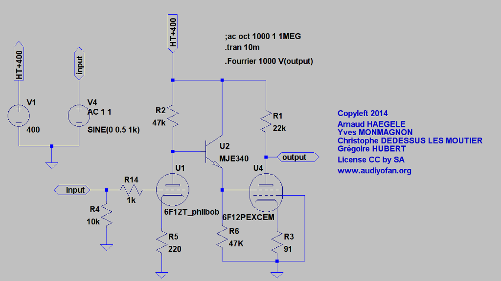
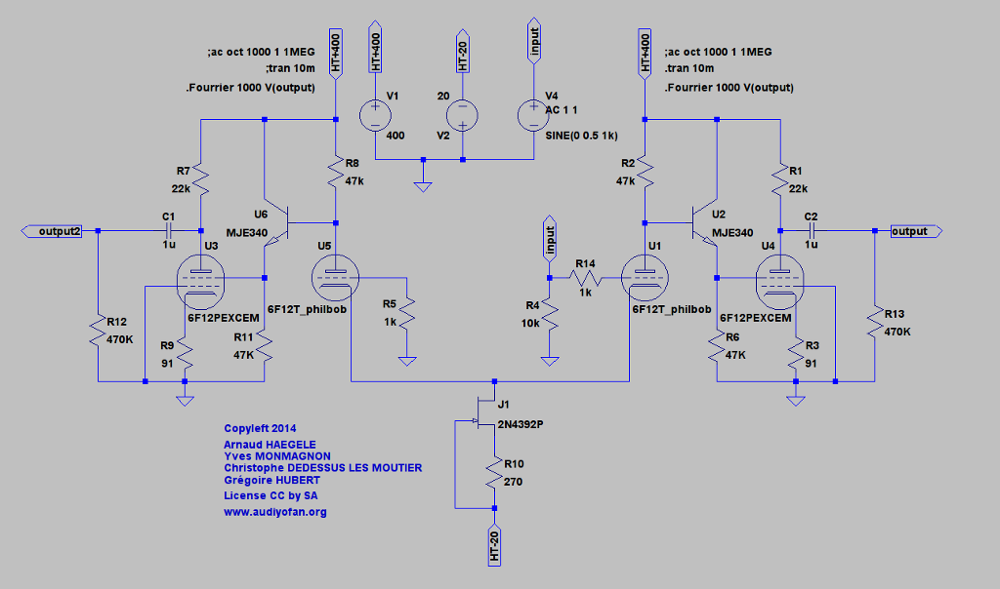
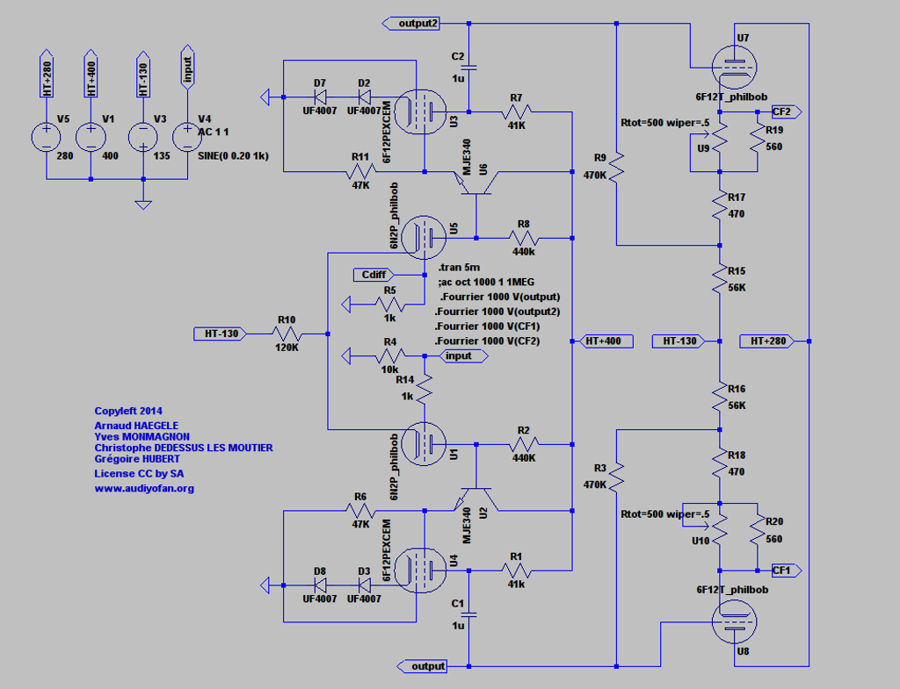
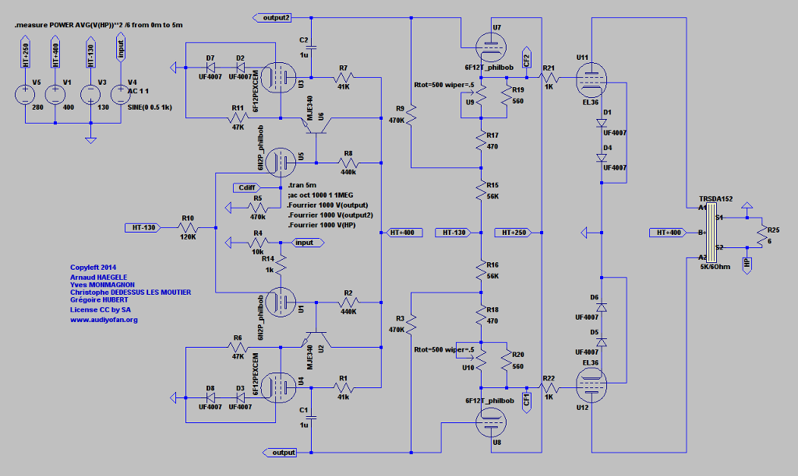
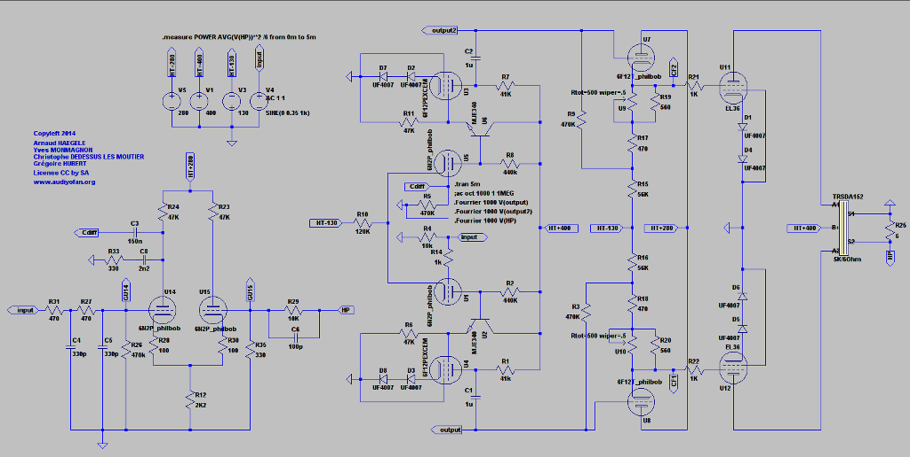
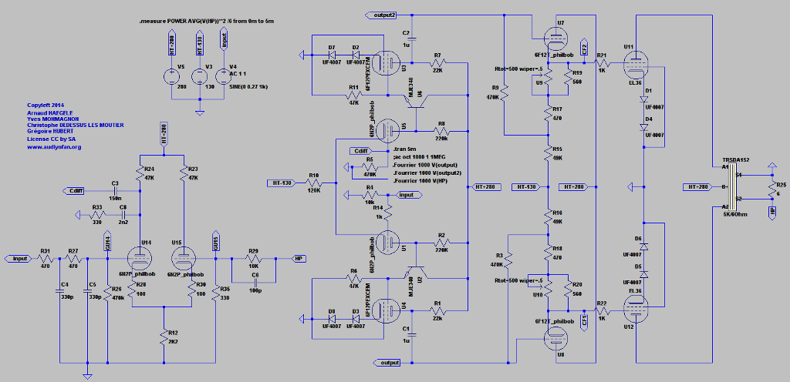

PP d'EL360 à correction différentielle
======================================

Ce projet est la réalisation d'un amplificateur audio à tubes à base d'EL360
incluant un système d'asservissement actif.

Vous trouverez dans le dossier LTspiceIV, deux sous dossiers
Le premier nommé Lib contiens les symboles de modèles additiuonnels de composant
ainsi que les fichiers de composant de base complété au gré des modélisations
ce dossier doit être copié dans vôtre dossier LTspiceIV afin de compléter
ce dernier

Idem pour le second nommé Mes Projets, qui contiens les fichiers .asc 
ainsi que les .inc  

Attention la simulation n'est qu'un outil d'aide à la conception
les résultats devraient être le plus proches possible de la vrai vie
mais ...

Quelques tentatives de simulation sous LTC vont permettre de débroussailler 
la guarrigue qu'est la topologie de driver un tube pentode par sa G2

Pour la petite histoire tout est parti de là

Qu'on a extrapolé en déphaseur

Puis on a rajouté un cathode follower

La finalité du projet étant un Push-Pull, un rapide calcul de droite de charge 
pour déterminer les points de fonctionnement et avancer un peu à l'aveugle 
a vrai dire !

Et enfin le schéma pour visualiser la correction différentielle,
ce dernier a nécessité quelques séances de "brainstorming"

Après quelques recherches d'idées et divers questionnement une simplification
du schéma au détriment d'une légère perte de puissance nous est apparu
comme une bonne alternative 

Toujours en quête d'améliorations, on s'est penché sur le déphaseur, il en 
ressort que pour guarantir un bon swing au CF qui alimente les finales
et pour ne pas perdre trop d'excursion versus le taux de distorsion 
Il serait préférable d'avoir 2 tensions HT, une vers 350 et l'autre 
vers 280, pour l'instant 

Les fichiers de simulations sont disponible dans le dossier "Mes projets", enjoy

To be continued

