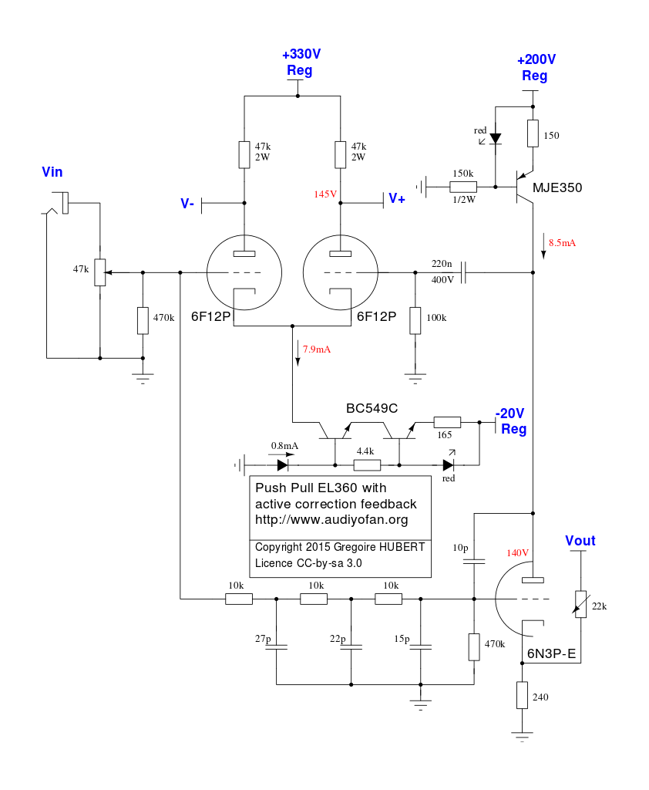

PP d'EL360 à correction différentielle
======================================

Ce projet est la réalisation d'un amplificateur audio à tubes à base d'EL360 incluant un système d'asservissement actif. Les EL360 sont les cousines des tubes télé EL36 dédiés à la déviation des électrons dans le tube cathodique. Ils ne sont absolument pas prévu pour une utilisation audio et ne sont pas linéaires car utilisés en impulsion. L'EL360 est la version durcie dédiée à une utilisation radar. Elle peut dissiper 16W en pentode et 18W en triode. 

Pour contourner le problème de linéarité de ce tube, il est piloté par la grille 2 ( grille 1 à la masse ) et l'amplificateur est asservi par une boucle de correction active à tubes. Pour plus d'infos à ce sujet, voici [une page de blog](http://jimbee.over-blog.com/page-3134517.html) qui présente les principes. La mise en œuvre ici est tirée du [travail d'Arnaud Haegele](http://6bm8-lab.fr/phpBB/viewtopic.php?f=3&t=170).

Ce projet nécessite l'utilisation de **tensions dangereuses** pouvant être mortelles. Ce projet est développé sous licence libre CC-by-sa 3.0. Les auteurs ne peuvent **en aucun cas** être tenus responsables de blessures, dommages directs ou indirects liés à la réalisation du projet décrit ci après et quelque soit leur nature. Cela est de votre responsabilité d'assurer votre sécurité et celle des autres, **vous êtes prévenus**.

