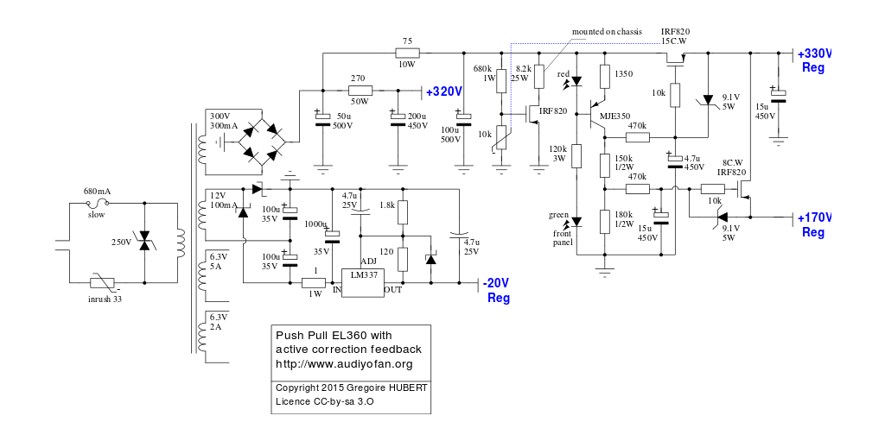

PP d'EL360 à correction différentielle
======================================

Ce projet est la réalisation d'un amplificateur audio à tubes à base d'EL360 incluant un système d'asservissement actif. Les EL360 sont les cousines des tubes télé EL36 dédiés à la déviation des électrons dans le tube cathodique. Ils ne sont absolument pas prévu pour une utilisation audio et ne sont pas linéaires car utilisés en impulsion. L'EL360 est la version durcie dédiée à une utilisation radar. Elle peut dissiper 16W en pentode et 18W en triode. 

Pour contourner le problème de linéarité de ce tube, il est piloté par la grille 2 ( grille 1 à la masse ) et l'amplificateur est asservi par une boucle de correction active à tubes. Pour plus d'infos à ce sujet, voici [une page de blog](http://jimbee.over-blog.com/page-3134517.html) qui présente les principes. La mise en œuvre ici est tirée du [travail d'Arnaud Haegele](http://6bm8-lab.fr/phpBB/viewtopic.php?f=3&t=170). L'idée de piloter les EL360 par la grille 2 a été émise par [John Hunter](http://home.alphalink.com.au/~cambie/EL36.htm#John_Hunter). Toutes les étapes de la conception et de la réalisation de ce projet sont exposée sur le [forum audiyofan](http://www.audiyofan.org/forum/viewtopic.php?f=60&t=9195).

Les caractéristiques de l'amplificateur sont en cours d'évaluation. Pour l'instant, les mesures ont donné les chiffres suivants :

 * Puissance de sortie : 25W dans 8Ω (pour un canal, cela devrait baisser pour les deux canaux).
 * Bande passante pour -1dB : 8Hz - 140kHz.
 * Le facteur d'amortissement évalué (non mesuré) est de 25.
 * La distorsion harmonique est de -71dB (0,02%) à 1W et -53dB (0,23%) à 10W.
 * La distorsion d'intermodulation est de -72dB (0,02%) jusqu'à l'écrêtage.
 * La distorsion d'amplitude est trop faible pour être mesurée à l'oscilloscope, on va passer au FFT.

Le schéma de l'alimentation a été en grande partie dictée par le transformateur d'alimentation que j'avais sous la main. Un transformateur avec 1×270V et 1×20V (ou plus) aurait été plus adapté.

Ce projet nécessite l'utilisation de **tensions dangereuses** pouvant être mortelles. Ce projet est développé sous licence libre CC-by-sa 3.0. Les auteurs ne peuvent **en aucun cas** être tenus responsables de blessures, dommages directs ou indirects liés à la réalisation ou la mise en œuvre du projet décrit ci après et ce quelque soit leur nature. Il est de votre responsabilité d'assurer votre sécurité et celle des autres, **vous êtes prévenus**.

