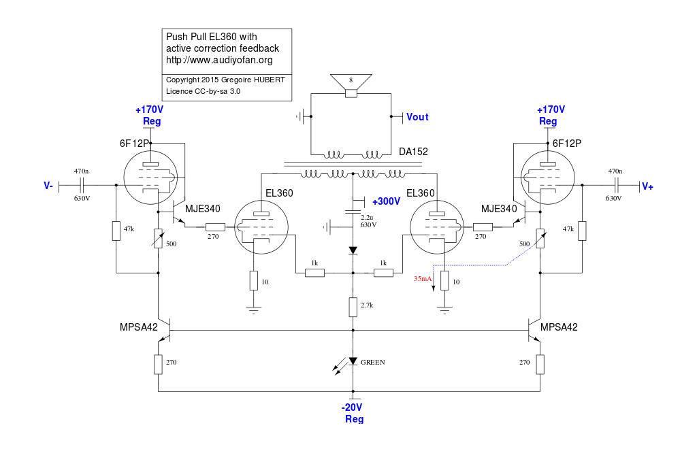

PP d'EL360 à correction différentielle
======================================

Ce projet est la réalisation d'un amplificateur audio à tubes à base d'EL360 incluant un système d'asservissement actif. Les EL360 sont les cousines des tubes télé EL36 dédiés à la déviation des électrons dans le tube cathodique. Ils ne sont absolument pas prévu pour une utilisation audio et ne sont pas linéaires car utilisés en impulsion. L'EL360 est la version durcie dédiée à une utilisation radar. Elle peut dissiper 16W en pentode et 18W en triode. 

Pour contourner le problème de linéarité de ce tube, il est piloté par la grille 2 ( grille 1 à la masse ) et asservi par une correction à tubes.

Ce projet nécessite l'utilisation de **tensions dangereuses** pouvant être mortelles. Ce projet est développé sous licence libre CC-by-sa 3.0. Les auteurs ne peuvent **en aucun cas** être tenus responsables de blessures, dommages directs ou indirects liés à la réalisation du projet décrit ci après et quelque soit leur nature. Cela est de votre responsabilité d'assurer votre sécurité et celle des autres, vous êtes prévenus.

Liste des composants :

 *  1 × TR pri 230V, secs 1 × 6.3V 5A, 1 × 6.3V 2.5A, 1 × 300V 300mA, 1 × 12V 100mA
 *  2 × DA152 (dissident audio 5kΩ/6Ω)
 *  4 × EL360 (ou EL36)
 *  4 × 6Φ12Π (6F12P)
 *  2 × 6H3Π-E (6N3P-E)
 *  4 × MPSA-42
 *  8 × BC338
 *  1 × MJE350
 *  2 × IRF820 (ou IRF830)
 *  1 × 50µF   500V
 *  1 × 200µF  500V
 *  1 × 15µF   450V
 *  2 × 100µF  35V
 *  1 × 1000µF 35V
 *  4 × 470nF  400V
 *  2 × 47nF   400V
 *  8 × 82kΩ   1W
 *  4 × 27kΩ   2W
 *  1 × 270Ω   50W ( vissée au châssis )
 *  1 × 220kΩ  0.5W
 *  1 × 91kΩ
 *  1 × 180kΩ  0.5W
 *  3 × 1kΩ
 * 10 × 10kΩ
 *  1 × 100kΩ
 * 10 × 470kΩ
 *  1 × 390Ω
 *  4 × 1Ω
 *  4 × 270Ω
 *  2 × 4.4kΩ
 *  2 × 75Ω
 *  2 × 750Ω
 *  2 × 22kΩ multitours
 *  4 × 470Ω multitours
 *  3 × Led (verte)
 *  1 × Led (rouge)
 *  1 × pont diodes 600V 20A
 *  2 × 1N4001
 *  2 × zener 9.1V 5W
 *  2 × zener 6.2V
 *  1 × zener 20V
 *  2 × diode courant 0.8mA
 *  

